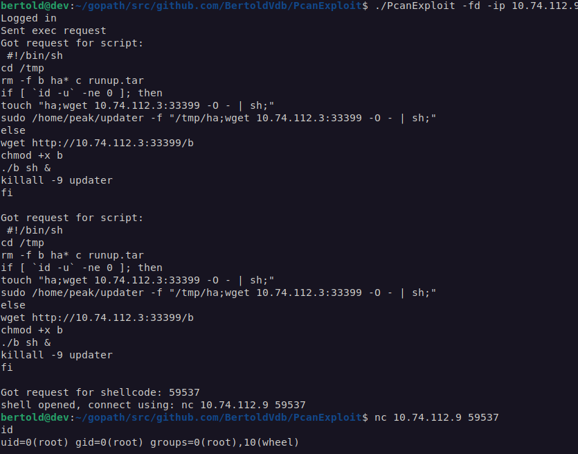
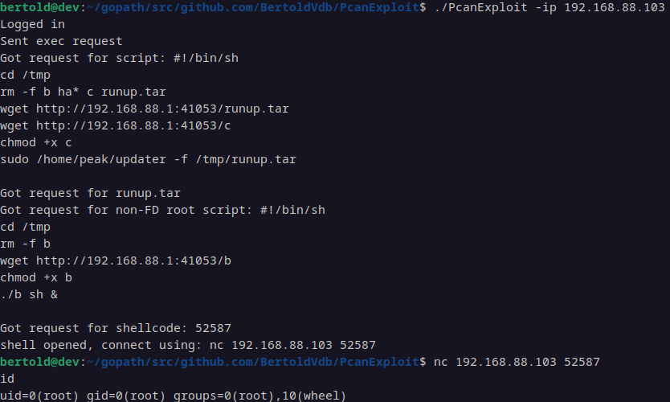

# CVE-2024-44610: PCAN-Ethernet Gateway FD DR Authenticated Root Exploit

## What is it?
This repository contains a Proof-of-Concept (PoC) exploit that executed code as root on Peak Ethernet gateways. It requires that you know the credentials to the web interface.

## How to fix it?
The vendor has rapidly provided fixed firmware:

 - [PCAN-Gateway FD Software Version 1.3.0](https://www.peak-system.com/PCAN-Gateway-FD-Software.540.0.html)
 - [PCAN-Gateway Software Version 2.11.0](https://www.peak-system.com/PCAN-Gateway-Software.348.0.html)

## How to use it?
Compile the program using Golang and then run as follows:
```./PcanExploit -ip 192.168.1.10 -httpaddr 192.168.1.250 -user admin -pass admin [-fd]```

If the exploit was successful a bindshell will be started on the device as root. You can see two screenshots at the bottom of this page.

The options have the following meaning:

 - ip: IP address of the gateway
 - httpaddr: IP address of the interface on the local computer to which the gateway is connected
 - user: Username
 - pass: Password
 - fd: Add this flag if the device is a CAN-FD gateway.

While the non-FD version is also vulnerable, this is of little practical importance since these devices don't implement signed firmware updates, and you could thus simply upload your own modified firmware.

## How does it work?
Two shell command injection vulnerabilities are used:

### Vulnerability 1: Command injection in device firmware update
It is possible to include a shell command in the filename of the update package that is uploaded to the web interface, for example: \
*test';ping 1.1.1.1;'.raucb*\
The command will be executed as the www-data user, which runs the webserver. The filename needs to have the right extension (tar or raucb depending on the device)

### Vulnerability 2: Command injection in /home/peak/updater
The binary internally runs system on the provided filename, as long as it exists. It can be exploited as follows: \
sudo /home/peak/updater -f "a;ping 1.1.1.1;"

Since this binary can be ran via sudo it is possible to execute the command as root.

## Screenshots
FD device:


Non-FD device:


